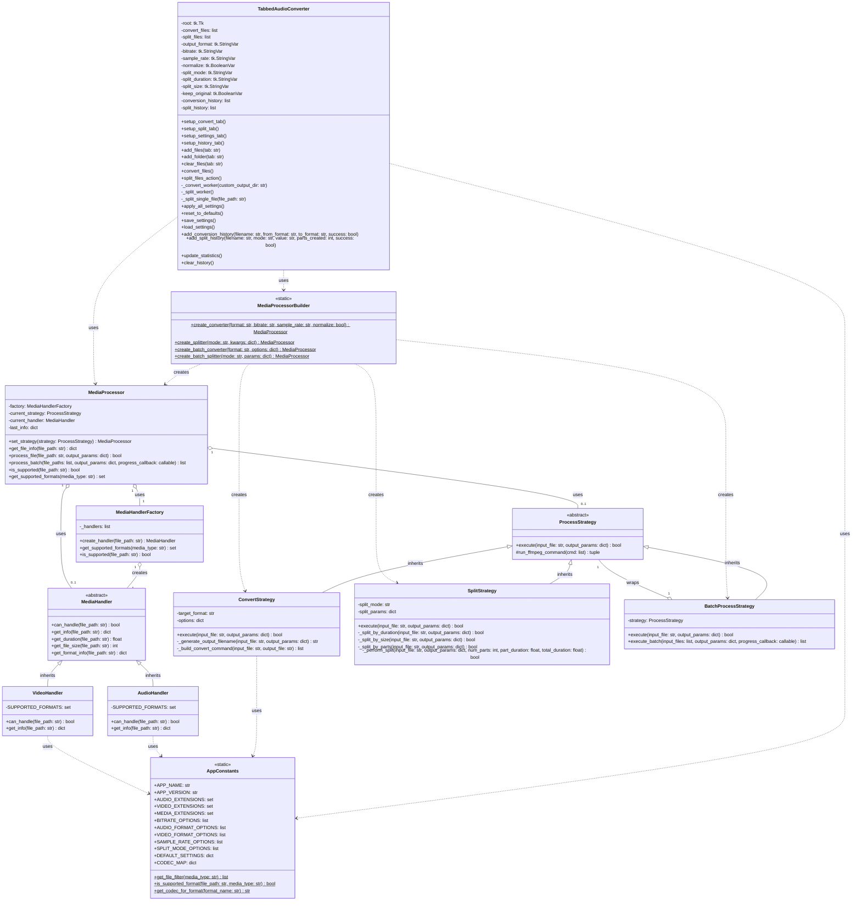

# 檔案豪幫手 - 系統架構圖

## 1. 系統分層架構圖

```
┌──────────────────────────────────────────────────────────────┐
│                     Presentation Layer (UI)                   │
│  ┌──────────────────────────────────────────────────────┐   │
│  │          audio_converter_tabbed.py                    │   │
│  │  ┌─────────┬──────────┬──────────┬─────────────┐    │   │
│  │  │ Convert │  Split   │ Settings │   History    │    │   │
│  │  │   Tab   │   Tab    │   Tab    │     Tab      │    │   │
│  │  └─────────┴──────────┴──────────┴─────────────┘    │   │
│  └──────────────────────────────────────────────────────┘   │
└──────────────────────────────────────────────────────────────┘
                              │
                              ▼
┌──────────────────────────────────────────────────────────────┐
│                    Business Logic Layer                       │
│  ┌──────────────────────────────────────────────────────┐   │
│  │              media_processor.py                       │   │
│  │  ┌──────────────────────────────────────────────┐   │   │
│  │  │  MediaProcessor    MediaProcessorBuilder     │   │   │
│  │  └──────────────────────────────────────────────┘   │   │
│  └──────────────────────────────────────────────────────┘   │
│                        ┌─────┴─────┐                         │
│            ┌───────────▼───┐   ┌───▼───────────┐            │
│            │ Factory Layer │   │ Strategy Layer │            │
│            └───────────────┘   └───────────────┘            │
└──────────────────────────────────────────────────────────────┘
                    │                    │
        ┌───────────▼────────┐  ┌───────▼────────┐
        │ media_handlers.py  │  │process_strategies│
        │                    │  │      .py         │
        │ ┌────────────────┐ │  │ ┌──────────────┐│
        │ │ AudioHandler   │ │  │ │ConvertStrategy││
        │ │ VideoHandler   │ │  │ │ SplitStrategy ││
        │ │HandlerFactory  │ │  │ │BatchStrategy  ││
        │ └────────────────┘ │  │ └──────────────┘│
        └────────────────────┘  └──────────────────┘
                    │                    │
                    └─────────┬──────────┘
                              ▼
┌──────────────────────────────────────────────────────────────┐
│                     Data/Config Layer                         │
│  ┌──────────────────────────────────────────────────────┐   │
│  │                 app_constants.py                      │   │
│  │  ┌────────────────────────────────────────────────┐  │   │
│  │  │ AppConstants                                   │  │   │
│  │  │ - AUDIO_EXTENSIONS  - DEFAULT_SETTINGS        │  │   │
│  │  │ - VIDEO_EXTENSIONS  - CODEC_MAP               │  │   │
│  │  └────────────────────────────────────────────────┘  │   │
│  └──────────────────────────────────────────────────────┘   │
└──────────────────────────────────────────────────────────────┘
                              │
                              ▼
┌──────────────────────────────────────────────────────────────┐
│                    External Dependencies                      │
│         ┌─────────┐  ┌─────────┐  ┌─────────────┐           │
│         │ FFmpeg  │  │ FFprobe │  │ File System │           │
│         └─────────┘  └─────────┘  └─────────────┘           │
└──────────────────────────────────────────────────────────────┘
```

## 2. UML 類別圖



## 3. 設計模式關係圖

```
┌─────────────────────────────────────────────────────────┐
│                    Factory Pattern                        │
│                                                           │
│  Client Request ──► MediaHandlerFactory                  │
│                            │                             │
│                            ▼                             │
│                   Check file extension                   │
│                            │                             │
│                ┌───────────┴───────────┐                │
│                ▼                       ▼                │
│         AudioHandler            VideoHandler             │
│         (.mp3,.wav...)          (.mp4,.avi...)         │
└─────────────────────────────────────────────────────────┘

┌─────────────────────────────────────────────────────────┐
│                   Strategy Pattern                        │
│                                                           │
│   MediaProcessor                                         │
│        │                                                 │
│        ├─► set_strategy(ConvertStrategy)                │
│        │        └─► execute() ──► Convert File          │
│        │                                                 │
│        ├─► set_strategy(SplitStrategy)                  │
│        │        └─► execute() ──► Split File            │
│        │                                                 │
│        └─► set_strategy(BatchProcessStrategy)           │
│                 └─► execute() ──► Process Multiple      │
└─────────────────────────────────────────────────────────┘

┌─────────────────────────────────────────────────────────┐
│                    Builder Pattern                        │
│                                                           │
│   MediaProcessorBuilder                                  │
│        │                                                 │
│        ├─► create_converter()    ──► MediaProcessor     │
│        │                              + ConvertStrategy  │
│        │                                                 │
│        ├─► create_splitter()     ──► MediaProcessor     │
│        │                              + SplitStrategy    │
│        │                                                 │
│        └─► create_batch_*()      ──► MediaProcessor     │
│                                       + BatchStrategy    │
└─────────────────────────────────────────────────────────┘
```

## 4. 資料流程圖

```
User Input (GUI)
      │
      ▼
TabbedAudioConverter
      │
      ├──► Select Files
      │
      ├──► Choose Operation (Convert/Split)
      │
      ▼
MediaProcessorBuilder
      │
      ├──► Create appropriate processor
      │
      ▼
MediaProcessor
      │
      ├──► MediaHandlerFactory.create_handler()
      │         │
      │         └──► Get file info
      │
      ├──► ProcessStrategy.execute()
      │         │
      │         └──► Run FFmpeg commands
      │
      ▼
Output Files + Update GUI
```

## 5. 模組依賴關係

```
                    ┌─────────────────────┐
                    │ audio_converter_    │
                    │    tabbed.py        │
                    └──────────┬──────────┘
                               │ depends on
                ┌──────────────┼──────────────┐
                ▼              ▼              ▼
        ┌──────────┐  ┌──────────────┐  ┌──────────┐
        │   app_   │  │    media_    │  │  media_  │
        │constants │  │  processor   │  │ handlers │
        └──────────┘  └──────┬───────┘  └──────────┘
                              │ depends on
                    ┌─────────┴──────────┐
                    ▼                    ▼
            ┌──────────────┐    ┌──────────────┐
            │   process_   │    │    media_     │
            │  strategies  │    │   handlers    │
            └──────────────┘    └──────────────┘
                    │                    │
                    └─────────┬──────────┘
                              ▼
                      ┌──────────────┐
                      │     app_     │
                      │  constants   │
                      └──────────────┘
```